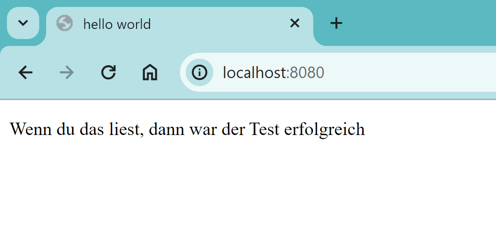

# KN02 Dockerfile

### A) Dockerfile I

1. Dockerfile erstellen und dokumentieren:
   
2.Docker-Build-Befehl ausführen:
```bash
docker build -t norisgiro/kn02a .
```

3.Image ins private Repository pushen:
```bash
docker push norisgiro/kn02a
```
4.Container erstellen und Webseite aufrufen:
```bash
docker run -d -p 8080:80 norisgiro/kn02a
```




