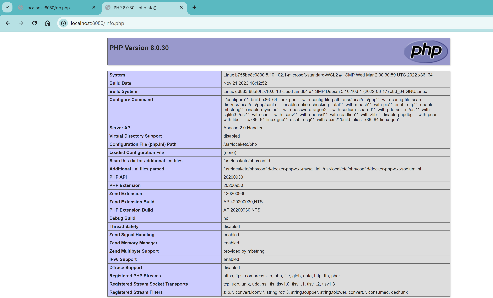
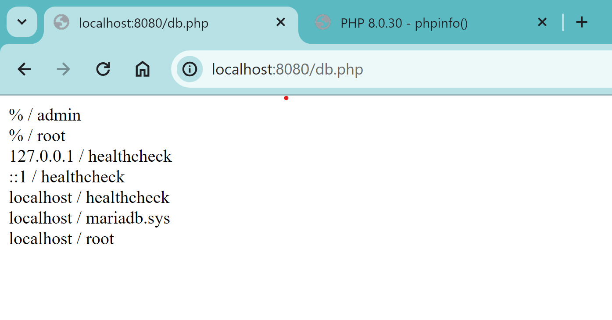

__Schritt 1:__ Erstellen des Dockerfiles für die Datenbank (DB)
Anschließend habe ich ein Dockerfile für die Datenbank erstellt, basierend auf dem Mariadb-Image. Dabei wurden Umgebungsvariablen für das MySQL-Passwort, die Datenbank und die Benutzerinformationen festgelegt.


__Schritt 2:__ Durchführen des Docker-Builds für die Datenbank
Anschließend wurde der Docker-Build-Befehl ausgeführt, um das Image für die Datenbank zu erstellen. Dadurch wurden die notwendigen Abhängigkeiten und Konfigurationen für den Datenbank-Container vorbereitet.

```bash
docker build -f Dockerfile(db) -t kn02b-db .
```
__Schritt 3:__ Ausführen des Docker-Runs für die Datenbank mit Netzwerkverbindung
Um die Kommunikation zwischen den Containern zu ermöglichen, wurde der Datenbank-Container gestartet ohne Verbindung zu einem spezifischen Netzwerk

```bash
docker run --name kn02b-db -d -p 3307:3306 kn02b-db
```
__Schritt 4:__ Erstellen des Dockerfiles für die Webseite (Web)
Nachdem die Datenbank eingerichtet war, wurde ein Dockerfile für die Webseite erstellt. Dabei wurde das PHP-Image mit Apache als Basis verwendet und die notwendigen Anweisungen zum Kopieren der Dateien und zur Installation von PHP mysqli hinzugefügt.


__Schritt 5:__ Durchführen des Docker-Builds für die Webseite
Nach der Erstellung des Dockerfiles für die Webseite wurde der Docker-Build-Befehl ausgeführt, um das Image für die Webseite zu erstellen.

```bash

docker build -f Dockerfile(web) -t kn02b-web .
```

__Schritt 6:__ Ausführen des Docker-Runs für die Webseite 
Starte den Web-Container und verwende `--link` um eine Verbindung zur Datenbank herzustellen. Dies ermöglicht der Webseite, auf die Datenbank zuzugreifen:

```bash
docker run --name kn02b-web --link kn02b-db:mysql -d -p 8080:80 kn02b-web
```

Mit `--link kn02b-db:mysql` wird der Datenbank-Container (kn02b-db) im Web-Container unter dem Alias `mysql` verfügbar gemacht. Das ermöglicht es deiner Webanwendung, über `mysql` auf die Datenbank zuzugreifen.
 
__Schritt 7:__ Überprüfung der Funktionalität
Abschließend wurde eine Überprüfung durchgeführt, indem ein Telnet-Befehl für den Zugriff auf den DB-Server durchgeführt und Screenshots der Seiten info.php und db.php gemacht wurden, um ihre Funktionalität zu überprüfen.





```bash
telnet kn02b-db 3306
```
Mit diesen Schritten wurde erfolgreich sichergestellt, dass die Docker-Container für die Webseite und die Datenbank erstellt wurden und miteinander kommunizieren können.