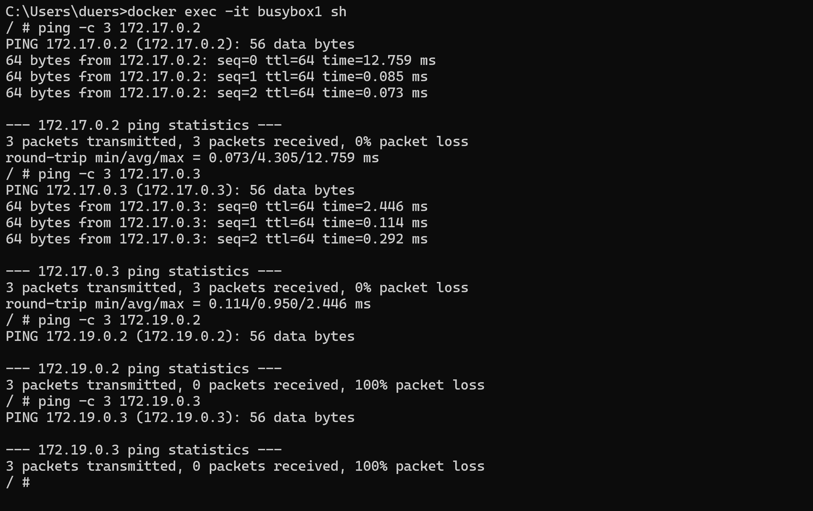

# KN03 

__Schritt 1.__ Netzwerke erstellen und Container starten

Ich erstelle das benutzerdefinierte Netzwerk "tbz" mit dem Befehl 
```bash
docker network create --driver bridge --subnet=172.19.0.0/16 tbz
```

__2__ Starten der BusyBox-Container
Ich starte 4 BusyBox-Container. Zwei davon sollen zum `default bridge` Netzwerk gehören und die anderen zwei zum `tbz` Netzwerk.

```bash
docker run -dit --name busybox1 busybox 
```
```bash
docker run -dit --name busybox2 busybox
```
Ich starte die zwei anderen Container im "tbz" Netzwerk:
```bash
docker run -dit --name busybox3 --network tbz busybox 
```
```bash
docker run -dit --name busybox4 --network tbz busybox
```

__3__ Überprüfung der Netzwerkkonfiguration und IP-Adressen
Ich verwende `docker inspect`, gefolgt vom Namen des Containers (z.B., `busybox1`), um die IP-Adresse jedes Containers zu finden. Danach notiere ich mir diese IP-Adressen.

busybox 1: 172.17.0.2
busybox 2: 172.17.0.3
busybox 3: 172.19.0.2
busybox 4: 172.19.0.3

Schritt 4: Test der Netzwerkkommunikation
 
Ich führte interaktive Sessions in `busybox1` und `busybox3` durch, um die Netzwerkkommunikation zu testen. Innerhalb dieser Sessions benutzte ich `ping`-Befehle, um die Erreichbarkeit und die Netzwerkisolierung zwischen den Containern zu überprüfen.



1. **Kommunikation innerhalb des gleichen Netzwerks:** Die `ping`-Befehle innerhalb des gleichen Netzwerks, also von `busybox1` zu `busybox2` und von `busybox3` zu `busybox4`, waren erfolgreich. Das zeigt, dass Container innerhalb desselben Netzwerks problemlos miteinander kommunizieren können.
 
2. **Isolation zwischen verschiedenen Netzwerken:** Die Versuche, von einem Container im `default bridge` Netzwerk (`172.17.*.*`) zu Containern im `tbz` Netzwerk (`172.19.*.*`) zu pingen, schlugen fehl (100% packet loss). Das zeigte das die Netzwerkisolation, die durch die Verwendung von unterschiedlichen Docker-Netzwerken erreicht wird. Container in unterschiedlichen Netzwerken können nicht direkt miteinander kommunizieren, es sei denn, es werden spezifische Netzwerkbrücken oder Routen konfiguriert.
hat Kontextmenü

#### Ping mit Namen
 
Wenn man busybox2 und busybox3 im busybox1 mit den Namen pingt würde das nicht funktionieren da busybox1 eine Bridge ist und nur IP erkennen kann, da busybox1 im allgeminen drin ist.
 
Wenn man busybox1 und busybox4 im im busybox3 pingt, würde busybox1 nicht fuktionieren da sie nicht im gleichen netzwerk sind. Aber busybox4 würde funktionieren da sie im gleichen netzwerk sind.

100% Packet loss = Hat nicht funktioniert
0% Packet loss= Hat funktioniert

Die Gemeinsamkeiten zwischen dem default bridge Netzwerk und einem benutzerdefinierten Netzwerk wie tbz liegen in der grundlegenden Netzwerkkommunikation zwischen Containern innerhalb des Netzwerks. Die Unterschiede liegen hauptsächlich in der Kontrolle über die Netzwerkkonfiguration, der Isolierung und der Verwaltung von IP-Adressbereichen. Ein benutzerdefiniertes Netzwerk bietet mehr Flexibilität und Kontrolle, was besonders nützlich ist, wenn komplexe Netzwerkkonfigurationen erforderlich sind oder spezifische Anforderungen an die Isolierung und Sicherheit vorliegen.